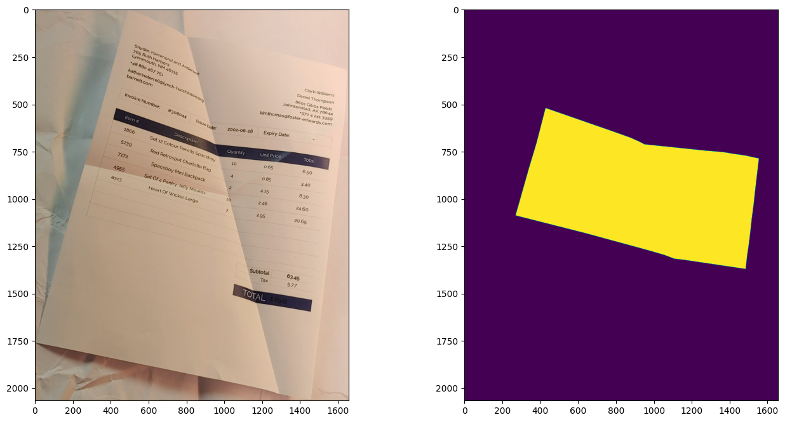
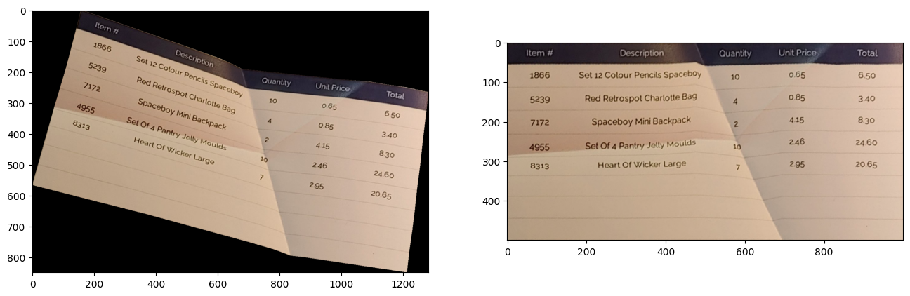

# Contour-based Image Rectification 

A small library to rectify masked images based on the mask contour.
Given an image and the corresponding binary mask:



the library extracts the mask area and unwarps it based on the mask contour.




## Usage

### VS-Code Devcontainer

We highly recommend to use the provided Devcontainer to make the usage as easy as possible:

- Install [Docker](https://www.docker.com/) and [VS Code](https://code.visualstudio.com/)
- Install VS Code Devcontainer extension `ms-vscode-remote.remote-containers`
- Clone the repository
  ```shell
  git clone git@github.com:FelixHertlein/contour-based-image-rectification.git
  ```
- Press `F1` (or `CTRL + SHIFT + P`) and select `Dev Containers: Rebuild and Reopen Container`
- Go to `Run and Debug (CTRL + SHIFT + D)` and press the run button, alternatively press `F5`

## Data

Mount your data folder to `/workspaces/contour-based-image-rectification/data/YOUR_DATA_DIRECTORY`.

## Exemplary Usage

Load the image and the mask
```python
from contour_based_image_rectification import load_image

image = load_image("../data/warped_document_multifold_color.jpg")
mask = load_image("../data/warped_document_multifold_color_mask.jpg")
mask = (mask > 128).any(axis=2)
```

Rectify the image
```python
from contour_based_image_rectification import rectify

image_rectified = rectify(image=image, mask=mask, output_shape=(500, 1000))
```


Note, that the most processing time is required for estimating the 4 corner points of the mask. If you already have corner points, you can provide them to the rectify function:

```python
from contour_based_image_rectification import rectify

corners = [(428, 520), (1552, 787), (1482, 1370), (270, 1087)]

image_rectified = rectify(image=image, mask=mask, output_shape=(500, 1000), corners=corners)
```

## Affiliations

<p align="center">
    
</p>

## License

MIT License as declared by the [licence file](LICENSE).


